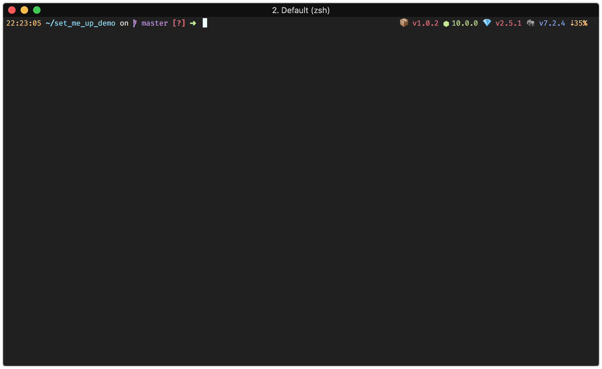
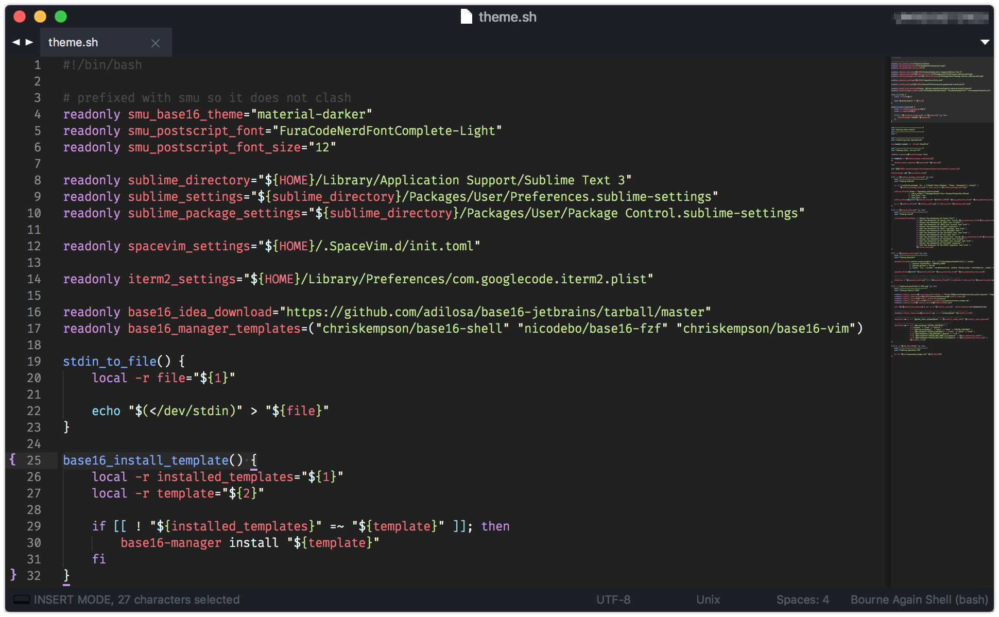
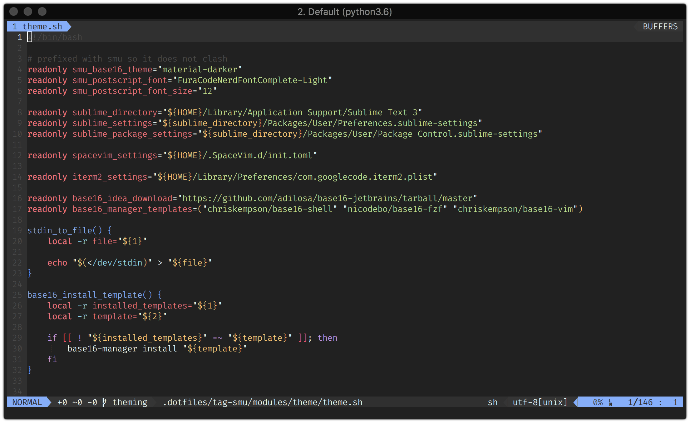
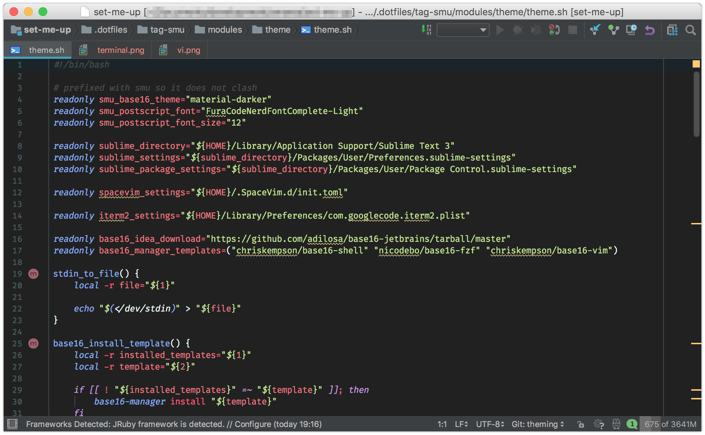

# set-me-up

set-me-up aims to simplify the dull setup and maintenance of macOS development environments.
It does so by automating the process through a collection of dotfiles and shell scripts [bundled into modules](#available-modules).

## Usage

**Note:** set-me-up is work in progress. A more standalone and versioned customization process is planned. 

No matter how you obtain smu, as a sane developer you should take a look at the provided modules and dotfiles to verify that no shenanigans are happening.

### Installing set-me-up

1. Use the installer to download set-me-up. By default this will put all files into ~/set-me-up, the default smu home directory.

       curl https://raw.githubusercontent.com/omares/set-me-up/master/.dotfiles/tag-smu/modules/install.sh | bash
        
   You can change the smu home directory by setting an environment variable called `SMU_HOME_DIR`. Please keep the variable declared as else the smu scripts are unable to pickup the sources.

2. Use the smu script, which you find inside the smu home directory, to run the base module. Check the [base module documentation](#base) for more insights.

       smu -p -m base
       
   After running the base module moving the source folder is not recommended due to the usage of symlinks.  
    
3. Afterwards provision your machine with [further modules](#available-modules) via the smu script. Repeat the `-m` switch to specify more then one module.
  
       smu -p -m essentials -m terminal -m php
       
   As a general rule of thumb only pick the modules you need, running all modules can take quite some time.
   Fear not, all modules can be installed to a later point of time when you need it.
    
### Customize set-me-up

As of right now forking this repository and using following approaches is the best way.

#### Using hooks

To customize the setup to your needs set-me-up provides two hook points: Before and after sourcing the module script.

Before hooks enable you to perform special preparations or apply definitions that can influence the module. All smu base variables are defined to check if an existing deceleration already exists, giving you the possibility to come with own values. E.g.: You could override the [to be installed ruby version](.dotfiles/tag-smu/modules/ruby/ruby.sh#L3) by pre defining the appropriate variable or change the sdkman installation directory.

Polishing module setups or using module functionality can be done with after hooks. A bit of inspiration: By calling git commands in an after hook file you could replace the git username and email dummies. Or install further extensions by using [the `extension_install` function of the php module](.dotfiles/tag-smu/modules/php/php.sh#L21).

To use hooks provide a `before.sh` or `after.sh` inside the module directory. Use rcm tags to provide the hook files.

#### Using rcm 

Through the power of [rcm tags](http://thoughtbot.github.io/rcm/rcup.1.html) set-me-up can favor your version of a file when you provide one. This mitigates the need to tinker directly with set-me-up source files.

[Create your own rcm tag](#creating-a-custom-tag) and then duplicate the directory structure and files you would like to adapt. rcm will combine all files from the given tags in the order you define. As example when you would like to modify the brewfile of the essentials module the path should look like `.dotfiles/tag-my/modules/essentials/brewfile`.

Use the `smu --lsrc` command to show how rcm would manage your dotfiles and to verify your setup.

* You can add new dotfiles and modules to your tag. rcm symlinks all files if finds. 
* File contents are not merged between tags, your file simply has a higher precedence and will be used instead.

##### Creating a custom tag

1. Fork the repository
2. Create a new rcm tag, by creating a new folder prefixed `tag-` inside the [`.dotfiles`](.dotfiles) directory: `.dotfiles/tag-my`
3. Add your tag to the [`.rcrc`](.dotfiles/rcrc) configuration file infront of the current defined tags. Resulting in `TAGS="my smu"`

## A closer look

### How does it work?

> Hamid: What's that?  
> Rambo: It's blue light.  
> Hamid: What does it do?  
> Rambo: It turns blue.

**TL;DR;** It symlinks all dotfiles and stupidly runs shell scripts. 

smu symlinks all dotfiles from the `.dotfiles` folder, which includes the modules, to your home directory. With the power of [rcm](https://github.com/thoughtbot/rcm), `.dotfiles/tag-smu/gitconfig` becomes `~/.gitconfig`. Using bash scripting the installation of brew is ensured. All this is covered by the base module and provides an opinionated base setup on which smu operates. 

Depending on the module further applications will be installed by "automating" their installation through other bash scripts.  
In most cases set-me-up delegates the legwork to tools that are meant to be used for the job. E.g. installing zplugin for zsh plugin management. 

Nothing describes the actual functionality better than code. It is recommended to check the appropriate module script to get the full insights. 
set-me-up is a plain collection of bash scripts and tools that you probably already worked with, therefor understanding what is happening will be easy. :)  

### Available modules

#### [base](.dotfiles/base)

The base module is the only module that is required to run at least once on your system to ensure the minimum required constraints for set-me-up to work. 

If not available it will install `brew` and then `rcm`. Afterwards `rcup` will be executed to symlink the dotfiles from the `.dotfiles` folder into your home directory. 

This is the only module that is not overwritable via rcm tag management as it is always sourced from the smu installation directory.

You can use `smu --lsrc` command to show which files will be symlinked to your home directory.

#### [editor](.dotfiles/tag-smu/modules/editor)

The editor module comes with [neovim](https://neovim.io/) and [vim](https://www.vim.org/), although neovim is considered to be used over vim. Should you enjoy using vi outside your terminal you can use [oni](https://www.onivim.io/). [SpaceVim](https://spacevim.org/) provides a good configuration base and is referenced in all three vi editors.

For tasks you don't want to solve in vi you can use [Intellij IDEA ultimate](https://www.jetbrains.com/idea/) or [Sublime3](https://www.sublimetext.com/). The Sublime configuration comes with a few [useful plugins](.dotfiles/tag-smu/modules/editor/editor.sh#L8-L19) that are managed via [Package Control](https://packagecontrol.io/).
  
[Macdown](https://macdown.uranusjr.com/) for Markdown editing, [p4merge](https://www.perforce.com/products/helix-core-apps/merge-diff-tool-p4merge) for merging/diffing and [diff-so-fancy](https://github.com/so-fancy/diff-so-fancy) as default git difftool are also part of the editor module.

Apart from theme and font all editors come preconfigured, except Intellij. ([SpaceVim](.dotfiles/tag-smu/SpaceVim.d), [Oni](.dotfiles/tag-smu/config/oni), [Sublime](.dotfiles/tag-smu/modules/editor/sublime)). To synchronize your Intellij configuration i recommend using the official [Settings Sync plugin](https://www.jetbrains.com/help/idea/sharing-your-ide-settings.html#IDE_settings_sync) 

Why no atom or Visual Studio Code?  
The above editors fulfil my daily needs and neither atom or Visual Studio Code were able to handle **large** files in multiple attempts. Not having an incentive to switch i continue using Sublime.

#### [essentials](.dotfiles/tag-smu/modules/essentials)

Installs a multitude of brew packages, casks and Mac App Store applications. Check the [brewfile](.dotfiles/tag-smu/modules/essentials/brewfile) to get an overview. 

#### [go](.dotfiles/tag-smu/modules/go)

Installs [goenv](https://github.com/syndbg/goenv) for version management and [dep](https://github.com/golang/dep) for package management. go1 is installed and defined as global version via goenv. 

When the terminal module is used the go installation will work out of the box as the required goenv code is already in place.

#### [java](.dotfiles/tag-smu/modules/java)

Installs [sdkman](http://sdkman.io/) to manage all java-world related packages. java8, java10, kotlin1, scala2, maven3, gradle4 and sbt1 are installed via sdkman. **java8** will be defined as global version. Android Studio is installed via brew cask.

#### [macos](.dotfiles/tag-smu/modules/macos)

Sets a bunch of macOS settings. The file is based on macos. None macos related setup calls have been removed. 

**It is highly recommended to work with a copy that is adapted to your needs!**

#### [macosupdate](.dotfiles/tag-smu/modules/macosupdate)

Runs the macOS updater via console call. 

Should your system require a system restart due to an `macosupdate` caused update, rerun the smu script after rebooting. The update module should be satisfied by the previous run and result in no action.

#### [php](.dotfiles/tag-smu/modules/php)

Installs PHP5, PHP7 and [composer](https://getcomposer.org/) for package management via brew. PHP7 will be defined as global version.  
For each version the apcu, amqp, igbinary and xdebug extensions are installed via pecl, memcached is installed from source.
 
The [phpswitch script](https://github.com/philcook/brew-php-switcher) enables you to switch between the installed versions. 

#### [python](.dotfiles/tag-smu/modules/python)

Installs [pyenv](https://github.com/pyenv/pyenv) for version management and [pipenv](https://github.com/pypa/pipenv) for package management. python2 and python3 are installed using pipenv. python3 will be defined as global version.

When the terminal module is used the python installation will work out of the box as the required pyenv code is already in place.

#### [ruby](.dotfiles/tag-smu/modules/ruby)

Installs [rbenv](https://github.com/rbenv/rbenv) for version management and [bundler](http://bundler.io/) for package management. ruby2 is installed and defined as global version via rbenv. 

When the terminal module is used the ruby installation will work out of the box as the required rbenv code is already in place.

#### [terminal](.dotfiles/tag-smu/modules/terminal)

Configures zsh as your default shell with sane zsh options and provides you with a list of useful plugins managed via [zplugin](https://github.com/zdharma/zplugin).

For flexibility and speed reasons set-me-up does not rely on any of the popular frameworks but picks a few plugins from these. To keep the console snappy all plugins are [loaded asynchronously](https://github.com/zdharma/zplugin#turbo-mode-zsh--53). 

Some of the plugins are:

* zsh-autosuggestions
* zsh-completions
* zsh-you-should-use
* fast-syntax-highlighting
* fasd
* fzf
* ... and more. Take a look at the [zplugin file](.dotfiles/tag-smu/zsh/zplugin.zsh) for a full overview.

By default the terminal module does not come with any theme or fancy prompt. Take a look at the theme module for that.

#### [theme](.dotfiles/tag-smu/modules/theme)

The [base16 material-darker theme](http://chriskempson.com/projects/base16/) and the [Nerd Font version of "Fira Code" called "Fura Code"](https://github.com/ryanoasis/nerd-fonts/tree/master/patched-fonts/FiraCode) are the two pillars of the theme module. For better readability the **light** version of the font will be configured and ligatures will be enabled if possible. 

[base16-manager](https://github.com/AuditeMarlow/base16-manager) is used to apply the theme to shell, vim and fzf. Font and/or theme for Sublime, SpaceVim, IDEA Intellij and iterm2 are applied programmatically by adapting the appropriate configuration files.  

In case you are using the [SMU terminal module](#terminal), [Spaceship ZSH prompt](https://github.com/denysdovhan/spaceship-prompt) will be enabled with a [custom configuration](.dotfiles/tag-smu/modules/theme/spaceship.plugin.zsh) that tries to not be in your way.

Oni is not included as its configuration is blended within a JavaScript file.

A few screenshots:

1. Terminal  
     
2. Sublime  
     
3. SpaceVim  
     
4. IntelliJ  
     
   
#### [web](.dotfiles/tag-smu/modules/web)

Installs [nodenv](https://github.com/nodenv/nodenv) for version management, npm comes with node for package management. node8 and node10 are installed using nodenv. node10 will be defined as global version.

When the terminal module is used the node installation will work out of the box as the required nodenv code is already in place. 

### Other components 

#### [The smu script](smu)

The `smu` script is wrapped with auto-generated [argbash.io](https://argbash.io/) code. It aims to make the usage of set-me-up as pleasant as possible.
It runs the given modules by sourcing the appropriate script and ensuring a few constraints: always run the base module and prioritize the macOS update to the beginning of the list. 
 
#### [update.sh](.dotfiles/tag-smu/modules/update.sh)

Tries it best to be useful as an updater of the provided sources. Work in progress ;)

## Credits

* [donnemartin/dev-setup](https://github.com/donnemartin/dev-setup)
  set-me-up was born as a fork of donnemartin/dev-setup and my curiosity to adapt it to my needs.
  As my PR was/is waiting to get merged i continued to rework most of the original code, thus set-me-up emerged.  
* [mathiasbynens](https://github.com/mathiasbynens/dotfiles) for his popular [macOS script](https://github.com/mathiasbynens/dotfiles/blob/master/.macos).   
* [argbash.io](https://argbash.io/) enabling library free and sane argument parsing.
* [brew](https://brew.sh/) and [brew bundle](https://github.com/Homebrew/homebrew-bundle) for the awesome package management.
* The great people who provide brew formulas and zsh plugins.  
* Especially [zimf](https://github.com/zimfw/zimfw), [oh-my-zsh](https://github.com/robbyrussell/oh-my-zsh/) and [prezto](https://github.com/sorin-ionescu/prezto) as i utilize plugins from these frameworks. And zplugin that has a high every barrier but gives the highest flexibility when it comes to zsh plugin management.  
* [thoughtbot rcm](https://github.com/thoughtbot/rcm) for the easy dotfile management. 
* All authors of the installed applications via set-me-up, i am in no way connected to any of them.

Should i miss your name on the credits list please let me know :heart:

## Contributions

Yes please! This is a GitHub repo for reasons. :)
